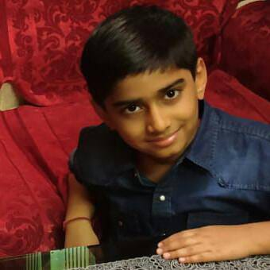
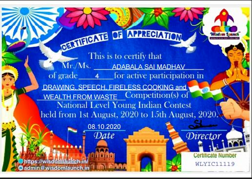
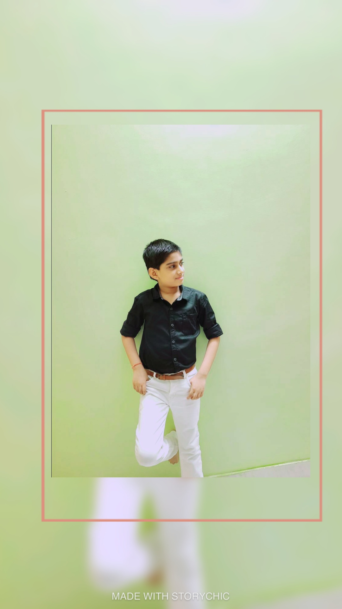
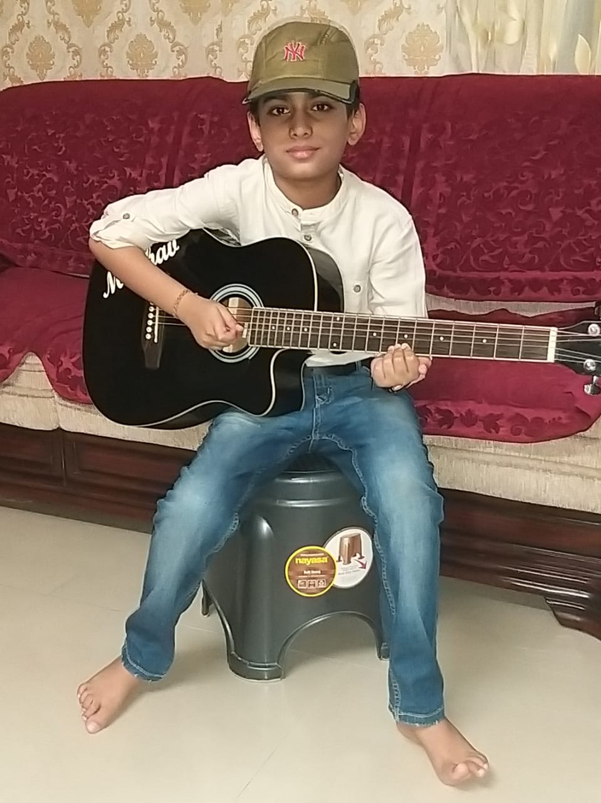

<!DOCTYPE html>
<html><head>
		<title>MY PROFILE</title>

		<meta name="viewport" content="width=device-width, initial-scale=1.0">

		
	</head>
<body>
		

			

				

				

					<h4>Sai Madhav</h4>
					
class 4th 
					Gyan Ganga Educational Academy

				

			

		

		

			

				<a href="">Profile</a><a href="">About</a><a href="">Contact</a>
			

		

		

			

				<h2>MY PROFILE</h2>
			

		

			

				

					
					
 My Certificate

						

			    	

					
					
My Pic

						

				

					
					
My Guitar

					

			

		

	

			

				<h2>About Me</h2>
			

		

   

				

					<h4 class="aligncenter">Personal Details</h4>
					<ul>
						<li>Name - A. Sai Madhav</li>
						<li>DOB - 20 March 2011</li>
						<li>PHONE - 9407624624</li>
						<li>HOBBY - Guitar, Art and Craft</li>
						<li>Email ID - adabalasaimadhav@gmail.com</li>
					</ul>
				

				

					<h4 class="aligncenter">Education/Nationality</h4>
					<ul>
						<li>Class - 4th</li>
						<li>Section - A</li>
						<li>School - Gyan Ganga Educational Academy</li>
						<li>State - Chhattisgarh</li>
                                                <li>Capital - Raipur</li>
						<li>Country - India</li>
					</ul>
				

			

		

		

			
© Copyright 2020.

		

	
</body></html>
